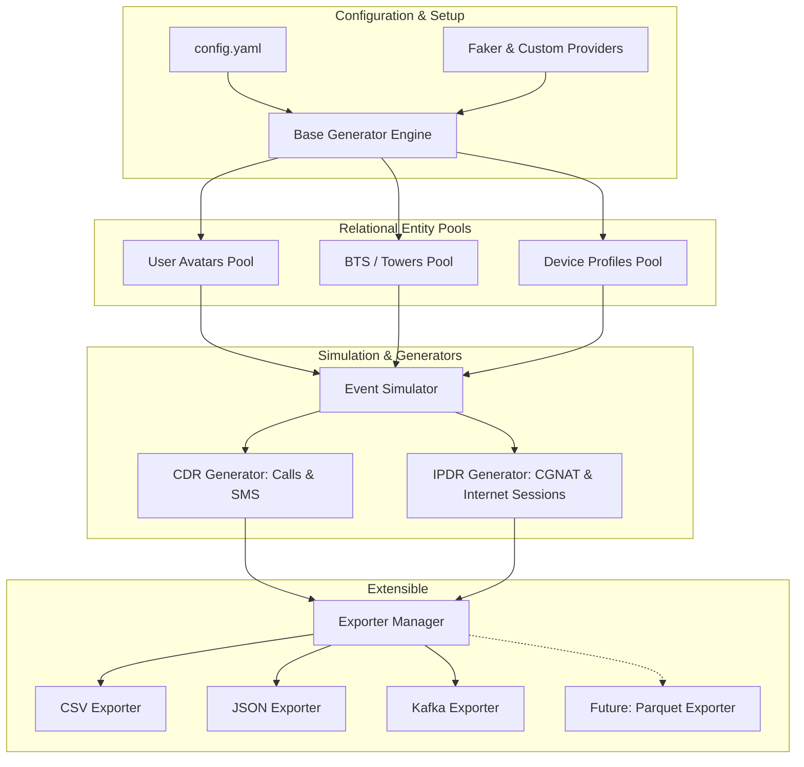

# 📡 SignalForge

**SignalForge** is a modular, high-fidelity synthetic data generator in Python for telecommunications and ISP logging. By modeling realistic entity pools—**Users**, **Base Transceiver Stations (BTS/Cell Towers)**, and **Devices**—using Python's `faker` library, SignalForge simulates and logs logically consistent **Call Detail Records (CDR)** and **IP Detail Records (IPDR)** with Carrier-Grade NAT (CGNAT) tracking.

Designed for developers, security researchers, and data pipeline engineers, SignalForge generates synthetically compliant logs mapped to the characteristics of major Indian Mobile Network Operators (MNOs) and ISPs (such as Jio, Airtel, Vi, BSNL, and ACT Fibernet) without leaking actual subscriber PII. All data records are produced with **uppercase header fields/keys**, matching standard enterprise logging guidelines.

---

## 🏗️ System Architecture

SignalForge separates core configurations, entity models, simulation logic, and data exporters. The event simulation engine models chronological behaviors, mapping user mobility and session allocations through geographically realistic cell towers before piping records to an extensible exporter pipeline.



---

## 🎨 Key Features

1. **Relational Generation:** Builds relational links between users, their specific devices (with brand/OS capabilities), and nearby cell towers (with realistic coordinate boundaries) so that generated logs aren't just random noise, but tell logical stories.
2. **Indian MNO & ISP Network Mapping:**
   * **Cellular MNOs:** Jio, Airtel, Vi, and BSNL with matched `MCC/MNC` pairs (e.g., Jio `405-840`, Airtel `404-45`) and +91 phone numbering formats.
   * **Broadband ISPs:** ACT Fibernet, Hathway, and Tata Play Fiber.
   * **ISP IP Pools:** Maps public IPs in IPDR sessions to realistic IP blocks belonging to actual Indian ISP autonomous systems.
3. **Advanced IPDR & CGNAT Simulation:**
   * Generates private source IPs in the CGNAT allocation range (`100.64.0.0/10`) or local subnets (`192.168.1.0/24` for home broadband).
   * Maps internal private IP/source ports to public IP/NAT ports, tracking the exact destination IP, port, and protocol (DoT compliance ready).
4. **Behavioral Personas & Diurnal Curves:**
   * Simulates realistic calling, texting, and data usage frequencies based on custom user personas (e.g., *Heavy Caller*, *Data Consumer*, *Night Owl*, *Standard*).
   * Models diurnal activity curves so network traffic naturally peaks during daytime/evening hours and declines during sleeping hours (2:00 AM – 6:00 AM).
5. **🔌 Ultra-Modular Exporter Design:** Exporters are decoupled from the generator engine. You can easily plug in new exporters (like database sinks or Apache Parquet files) by subclassing a simple interface.
6. **🏢 Enterprise Capitalization:** All generated CSV columns and JSON/Kafka dictionary keys are automatically exported in **UPPERCASE** headers for compliance integration.

---

## ⚙️ Modular Exporter Architecture

To support easy extensions (such as streaming to **Apache Kafka** or writing to **Apache Parquet**), the project implements a standard **Strategy Pattern** for exporters:

```python
# How easy it is to add a new exporter:
from signal_forge.exporters.base import BaseExporter

class CustomExporter(BaseExporter):
    def __init__(self, target_sink_params):
        # Initialize your custom client context
        self.client = MyClient(target_sink_params)

    def open(self, record_type: str, destination_name: str):
        # Open your files or connect network sockets
        self.destination = destination_name

    def write_record(self, record: dict):
        # Uppercase transformation is automatically handled.
        # Pipe record dictionary to target sink!
        self.client.push(self.destination, value=record)

    def close(self):
        # Flush buffers and clean up resources
        self.client.disconnect()
```

---

## 📂 Project Directory Structure

```text
signal_forge/
├── exporters/
│   ├── __init__.py
│   ├── base.py           # BaseExporter abstract class
│   ├── csv_exporter.py   # Standard CSV file exporter
│   ├── json_exporter.py  # Standard JSON file exporter
│   └── kafka_exporter.py # Real-time Apache Kafka topic exporter
├── generators/
│   ├── __init__.py
│   ├── base.py           # Abstract generator pool manager
│   ├── cdr.py            # Call & SMS simulation logic
│   └── ipdr.py           # Internet & CGNAT log simulation logic
├── models/
│   ├── __init__.py
│   ├── bts.py            # Base Transceiver Station (tower) schema
│   ├── device.py         # Device profile schema
│   └── user.py           # User profile schema and behavior personas
├── providers/
│   ├── __init__.py
│   └── telecom.py        # Custom Faker providers (IMSI, IMEI, CGNAT IPs)
├── config.yaml           # Simulation weight configurations
├── main.py               # CLI entry point to run simulations
├── requirements.txt      # Python dependencies
├── Dockerfile            # Standalone Docker deployment file (uv-based)
├── .dockerignore         # Docker context ignore rules
└── README.md             # Project overview and documentation
```

---

## 🚀 Getting Started

### 1. Prerequisites & Installation
Ensure you have Python 3.8+ installed.

```bash
# Clone the repository
git clone https://github.com/ErVijayRaghuwanshi/signal-forge.git

# Clone the repository and navigate inside
cd signal-forge

# Install the required dependencies using uv (or standard pip)
uv pip install -r requirements.txt
```

### 2. Configuration (`config.yaml`)
You can tweak parameters, subscriber counts, geographical bounding boxes, and MNO distribution weights in `config.yaml`:

```yaml
simulation:
  time_zone: "Asia/Kolkata"
  mno_distribution:
    Jio: 0.42
    Airtel: 0.36
    Vodafone_Idea: 0.16
    BSNL: 0.06
```

---

## 💻 Running the Simulation

SignalForge runs in two modes: **Batch Backfill Mode** (generates static log dumps) and **Continuous Streaming Service Mode** (runs continuously like a live network, pushing logs directly to files or local Kafka topics).

### A. Continuous Streaming Mode (Service Mode) 📡

To run SignalForge as a live background service that generates simulated records in real-time and streams them continuously:

#### 1. Stream Directly to your Local/External Apache Kafka
Make sure your Kafka broker is running (e.g., at `localhost:9092`). Launch the streaming engine using:

```bash
source .venv/bin/activate

# Stream continuously directly to your local Kafka broker!
# Pacing: Speed 60.0 means 1 simulated hour of activity is paced and generated every 1 minute of wall time.
python3 main.py --format kafka --stream --speed 60.0 --kafka-bootstrap "localhost:9092"
```

*Topics will automatically receive records:*
* `cdr-records`: Receives Call and SMS events in real-time.
* `ipdr-records`: Receives Internet and CGNAT log events in real-time.

#### 2. Stream Paced Events to Local Files (`.jsonl` or `.csv`)
If you want to stream real-time paced events directly into growing log files on your system without Kafka:

```bash
source .venv/bin/activate

# Stream continuously, appending paced events into output/cdr_records.jsonl and output/ipdr_records.jsonl
python3 main.py --format json --stream --speed 120.0 --output-dir ./output
```

---

### B. Batch Backfill Mode (Static Generation) 📁

If you just need a fixed-size historical dataset dumped instantly:

```bash
source .venv/bin/activate

# Generates 100 users, 15 towers, and dumps 2000 historical records to ./output in CSV format
python3 main.py --users 100 --towers 15 --records 2000 --output-dir ./output --format csv
```

---

## 🐳 Containerized Execution (Docker)

SignalForge features a cutting-edge `Dockerfile` powered by **Astral's `uv` package manager** for ultra-fast builds and small image footprints.

### 1. Build the Docker Image
Build the standalone container locally:
```bash
docker build -t signal-forge .
```

### 2. Stream to your Host Kafka Broker (Direct CLI)
If your Kafka broker is running on the host machine (`localhost:9092`), you can stream directly from the container to the host by using Docker's special host network helper. 

**Since the Kafka streaming command is configured as the default inside the Dockerfile, you can launch the live stream instantly with a single command:**

```bash
docker run --net="host" signal-forge
```

*This automatically launches the continuous stream at `60.0x` speed pointing to the broker at `localhost:9092`!*

### 3. Run Containerized Batch Generation with Mount Volumes
If you want to override the default streaming behavior and dump static file-based records from the container into your host's local `./output` folder:

```bash
docker run -v "$(pwd)/output:/app/output" signal-forge --users 100 --records 2000 --format csv
```

---

### 🛠️ CLI Arguments Supported

| Argument | Type | Default | Description |
| :--- | :--- | :--- | :--- |
| `--users` | `int` | `100` | Size of the simulated customer database pool. |
| `--towers` | `int` | `15` | Number of cell towers to simulate in the geographic grid. |
| `--records` | `int` | `2000` | Maximum limit of static records to generate per type (Batch Mode). |
| `--format` | `str` | `"csv"` | Output destination format: `csv`, `json` (JSON Lines), or `kafka` (Topic stream). |
| `--stream` | `flag` | *None* | **Enable infinite continuous streaming daemon mode.** |
| `--speed` | `float` | `60.0` | **Simulation clock speed multiplier.** (e.g. 60.0 simulates 1 hour in 1 wall minute). |
| `--kafka-bootstrap`| `str` | `"localhost:9092"`| Bootstrap broker host string for Kafka streams. |
| `--kafka-cdr-topic`| `str` | `"cdr-records"` | Kafka topic designated for voice and SMS CDR events. |
| `--kafka-ipdr-topic`| `str` | `"ipdr-records"`| Kafka topic designated for internet/CGNAT IPDR events. |
| `--kafka-schema-registry`| `str` | *None* | Schema Registry endpoint. Defaults to `KAFKA_SCHEMA_REGISTRY_URL` env var. |
| `--output-dir` | `str` | `"./output"` | Local folder where CSV/JSON log dumps are exported. |
| `--days` | `int` | `1` | Backfill history range in days (Batch Mode). |
| `--region` | `str` | `"Mumbai"` | Cities coordinates grid presets: `Mumbai`, `Delhi_NCR`, `Bengaluru`. |
| `--config` | `str` | `"config.yaml"`| Path to simulation weight settings configuration yaml. |

---

## 🔄 Modifying Schemas & Adding New Fields

If you want to add a new field (e.g., `5G_BAND` to CDR records or `SESSION_ID` to IPDR records), you must make modifications in two places:

### Step 1: Update the Event Generator Logic
Modify the generator files to construct and simulate the new field:
- **CDR Records**: Update the dictionary returned by `_simulate_event` inside [cdr.py](file:///Users/ervijay/Documents/Programs/Repo/signal-forge/signal_forge/generators/cdr.py).
- **IPDR Records**: Update the dictionary returned by `_simulate_data_session` inside [ipdr.py](file:///Users/ervijay/Documents/Programs/Repo/signal-forge/signal_forge/generators/ipdr.py).

*Note: All generator dictionary keys are automatically converted to **UPPERCASE** upon export. You can use lowercase or uppercase keys in the generator as you prefer; they will be serialized as uppercase.*

### Step 2: Update the Schema Registry Definitions
Update the corresponding Avro schema dictionaries inside [kafka_exporter.py](file:///Users/ervijay/Documents/Programs/Repo/signal-forge/signal_forge/exporters/kafka_exporter.py):
- **CDR Schema**: Add the field definition to `CDR_SCHEMA_DICT`.
- **IPDR Schema**: Add the field definition to `IPDR_SCHEMA_DICT`.

> [!IMPORTANT]
> 1. **Uppercase Field Names**: Since the exporter converts all record keys to uppercase, the `"name"` property of your new field in the Avro schema **must be in UPPERCASE** (e.g., `{"name": "SESSION_ID", "type": "string"}`).
> 2. **Schema Compatibility**: To maintain backward and forward compatibility (allowing older consumers to read new messages, and new consumers to read old cached messages), you should assign a **default value** or make the field **nullable/optional**.
>    - *Example (Required with default)*: `{"name": "NEW_FIELD", "type": "string", "default": "N/A"}`
>    - *Example (Nullable/Optional)*: `{"name": "NEW_FIELD", "type": ["null", "string"], "default": null}`

